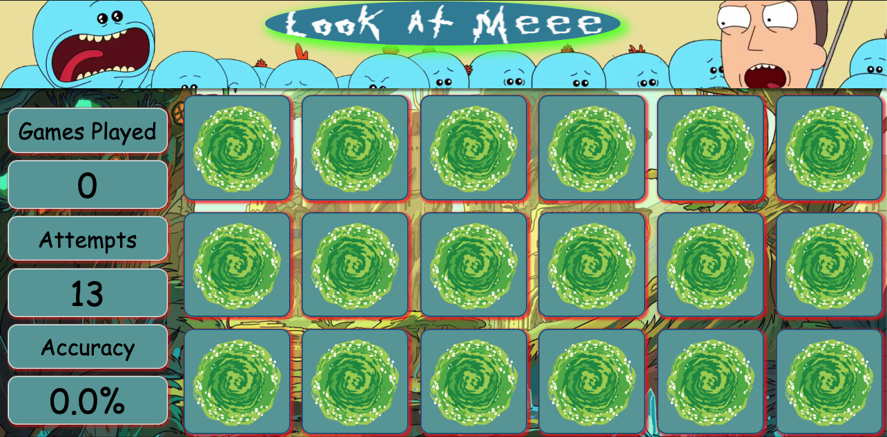

# memory-match
A javascript memory match game theme from Rick and Morty

Desktop Oriented

## Technologies Used

- JavaScript
- jQuery
- HTML5
- CSS3

## Features
User can click on cards to reveal card image
User can see stats based on their in-game performance
User can see a win condition modal
User can restart the game after reaching the win condition

## DEMO
Try the working version at: https://memorymatch.tomascormons.tech

## Example

Maintained by `tcormons`
